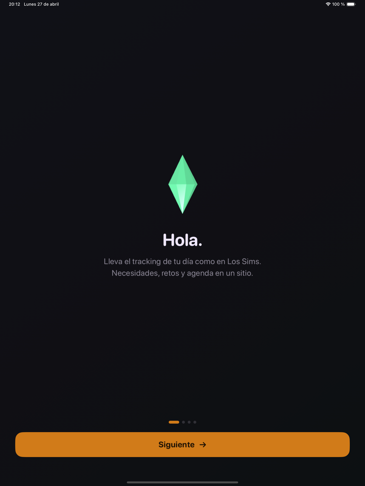
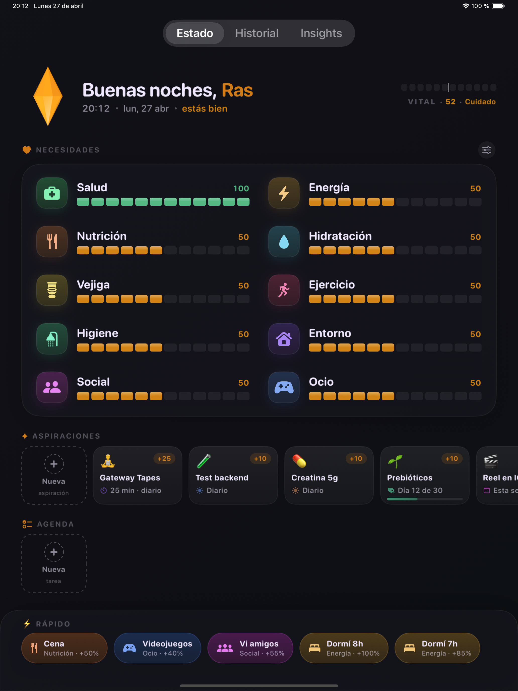

# me-sims-tracker

Personal life tracker that treats your day like a Sims save file. SwiftUI iOS/iPadOS app with 10 need bars that decay over time, custom aspirations (recurring challenges), one-off agenda tasks, and a global VITAL score.

Backed by a Cloudflare Worker so you (or Claude, via an MCP server) can read and write your data from anywhere.

|  Onboarding  |  Dashboard  |
| --- | --- |
|  |  |

## What's inside

**iOS app** (`MySimsLife/`)
- 10 needs: Health, Energy, Nutrition, Hydration, Bladder, Exercise, Hygiene, Environment, Social, Leisure. All toggleable per user.
- Faceted procedural plumbob built with SceneKit, color-shifts with the global mood.
- VITAL score 0–100 shown as a bidirectional bar (red ← center → green) on the header.
- Aspirations: daily/weekly/treatment-based personal challenges with XP per completion.
- Agenda: one-off tasks with optional due time, draggable to reorder.
- Quick-action chips that rotate based on what's low and what you haven't logged today.
- Dark-only, dusty-pastel palette. Indicative bar colors (sage / honey / orange / crimson) by value, not by need identity.

**Backend** (`backend/`)
- Hono on Cloudflare Workers + D1 (SQLite). Free tier covers personal use forever.
- REST CRUD for `aspirations`, `tasks`, `activity_log`, `needs_state` with soft-delete.
- `GET /sync?since=<ms>` for incremental pull.
- `X-API-Key` auth.

**MCP server** (`mcp-server/`)
- Node + `@modelcontextprotocol/sdk`.
- Exposes the backend as tools to Claude: `add_aspiration`, `complete_task`, `log_action`, `recent_activity`, `get_overview`, etc.
- Lets you say things like *"add a 'read 30 min' aspiration"* or *"I just drank water"* and have it land in the iPad on next sync.

## Stack

- SwiftUI + SwiftData (iOS 17+ / macOS 14+)
- SceneKit for the 3D plumbob
- XcodeGen (`project.yml`)
- Cloudflare Workers + D1
- Hono · TypeScript · Wrangler
- Model Context Protocol SDK

## Local setup

The repo contains three projects: the iOS app, the backend, and the MCP server. They are independent.

### iOS app

```bash
xcodegen generate
open MySimsLife.xcodeproj
```

Then in Xcode select your iPad as destination and Cmd+R. Personal Apple ID works (cert expires every 7 days; reopen Xcode and Run again to re-sign).

Before the first build, copy the credentials template and fill in your backend key:

```bash
cp MySimsLife/Store/BackendCredentials.swift.example MySimsLife/Store/BackendCredentials.swift
# Edit the file and set your baseURL + apiKey
```

`BackendCredentials.swift` is gitignored.

### Backend

See [`backend/README.md`](backend/README.md) for the full Cloudflare setup. TL;DR:

```bash
cd backend
npm install
npx wrangler d1 create me-sims-tracker     # paste the id into wrangler.toml
npm run db:migrate:remote
echo "$(openssl rand -hex 32)" | npx wrangler secret put API_KEY
npm run deploy
```

You'll get a URL like `https://me-sims-tracker.<your-user>.workers.dev`. Plug that URL + the API key into `BackendCredentials.swift` (app) and the MCP server env (`SIMS_API_KEY`).

### MCP server (Claude integration)

```bash
cd mcp-server
npm install
npm run build

claude mcp add me-sims-tracker --scope user \
  --env "SIMS_API_KEY=<your-api-key>" \
  -- node "$(pwd)/dist/index.js"
```

Restart Claude Code. The tools become available in any session.

## Sync model

- **Local-first**: every action mutates SwiftData first, then fires a push to the backend in the background.
- **Pull-on-launch**: `BackendSync.pull(into:)` runs once when the app boots, fetching everything modified since `lastSync` (stored in `UserDefaults`).
- **Conflict resolution**: last-write-wins by `updated_at`. Soft-deletes survive concurrent edits.
- **No CloudKit, no Apple Developer Program required**: your own backend means it works on a free Apple ID.

## Project layout

```
backend/                 # Cloudflare Worker (Hono + D1)
  migrations/0001_initial.sql
  src/index.ts
  wrangler.toml

mcp-server/              # Node MCP server for Claude
  src/index.ts

MySimsLife/              # SwiftUI app
  App/
  Models/                # NeedType, Aspiration, LifeTask, ActivityLog
  Store/                 # NeedStore, BackendSync, CalibrationEngine
  Theme/                 # SimsTheme, Date+TimeAgo
  Views/
    Dashboard/           # DashboardView, NeedBarView, PlumbobView (SceneKit), …
    Onboarding/
    Settings/            # CategoriesEditor
    History/  Insights/

docs/                    # README screenshots
project.yml              # XcodeGen config
```
