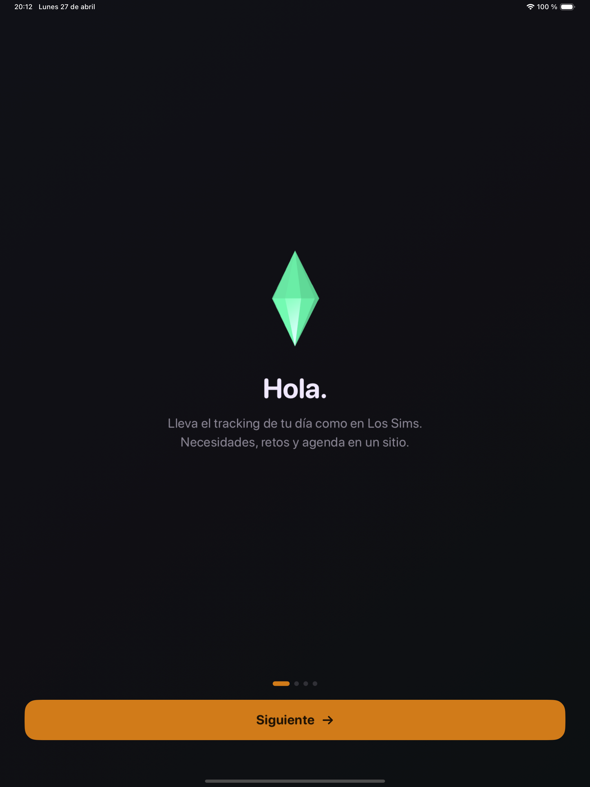
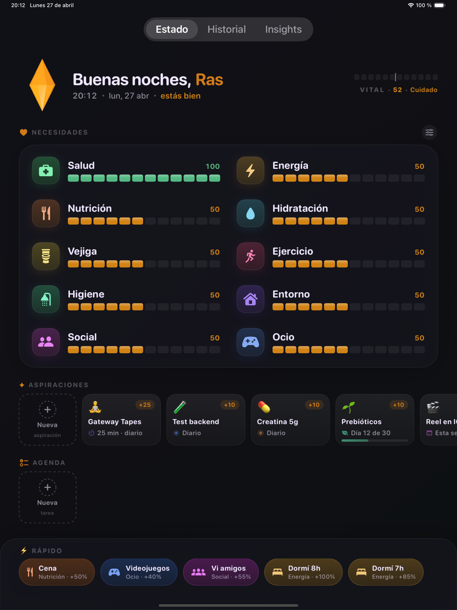

# Livebars

A private life tracker for iOS, inspired by The Sims.

Track your needs, aspirations, treatments, and daily tasks with friendly bars that fill when you log what you do. Everything stays on your device and in your private iCloud account — no server, no analytics, no ads.

|  Onboarding  |  Dashboard  |
| --- | --- |
|  |  |

## What's inside

- **11 needs**: Physical health, Mental health, Energy, Nutrition, Hydration, Bladder, Exercise, Hygiene, Environment, Social, Leisure. Toggleable per user.
- **Faceted procedural plumbob** (SceneKit), colour-shifts with the global mood.
- **VITAL score** 0–100 shown as a bidirectional bar (red ← centre → green) on the header.
- **Aspirations**: daily / weekly / one-shot personal challenges with XP per completion.
- **Agenda**: one-off tasks with optional due time, draggable to reorder.
- **Medicine cabinet**: treatments and supplements with reminders and dose tracking.
- **Quick-action chips** that rotate based on what's low and what you haven't logged today.
- **Sims-2 periwinkle palette**, indicative bar colours (sage → honey → orange → crimson) by value, not by need identity.
- **Accessible**: VoiceOver labels on every custom view, Dynamic Type, Reduce Motion, WCAG AA contrast, percentage labels on bars for colour-blind users.

## Stack

- SwiftUI + SwiftData (iOS 17+ / macOS 14+)
- **CloudKit** (`cloudKitDatabase: .automatic`) for cross-device sync — no backend, no servers
- iCloud Key-Value Store for prefs (username, notification toggles)
- SceneKit for the 3D plumbob
- XcodeGen (`project.yml`)

## Sync model

Source of truth = **CloudKit**. Each device writes to its local SwiftData store; CloudKit pushes/pulls automatically.

- **Local-first**: every action mutates SwiftData first, then CloudKit syncs in the background.
- **Realtime cross-device**: `NSPersistentStoreRemoteChange` notifications wake the store when another device makes a change, debounced by 0.5 s.
- **Bar values**: stored as `NeedAnchor` rows (value + anchoredAt). Each device computes the decayed display value locally from the anchor — so all devices converge to the same value regardless of when they last opened the app.
- **Prefs**: `CloudPrefsMirror` mirrors `userName`, notification settings, and threshold/cooldown to `NSUbiquitousKeyValueStore`.

## Local setup

```bash
xcodegen generate
open MySimsLife.xcodeproj
```

Then in Xcode select your iPhone / iPad as the destination and ⌘R. Requires an Apple Developer Program account ($99/yr) because CloudKit needs a real iCloud container.

## Calibration

The app lives or dies by how fast bars decay, how much each action boosts, and what VITAL counts as "healthy". Tweaking those values requires running the calibration harness:

```bash
swift Tools/CalibrationCheck.swift
```

34 checks pass on the default tuning. Full spec → [`docs/CALIBRATION.md`](docs/CALIBRATION.md).

## Project layout

```
MySimsLife/              # SwiftUI app
  App/
  Models/                # NeedType, NeedAnchor, Aspiration, LifeTask, Treatment, ActivityLog
  Store/                 # NeedStore, CloudPrefsMirror, MockData, NotificationManager
  Theme/                 # SimsTheme, Accessibility, Date+TimeAgo
  Views/
    Dashboard/           # DashboardView, NeedBarView, PlumbobView (SceneKit), …
    Onboarding/
    Settings/            # SettingsView + drill-down detail screens
    History/

docs/                    # README screenshots + CALIBRATION.md
Tools/                   # screenshots.sh, CalibrationCheck.swift
project.yml              # XcodeGen config
```
